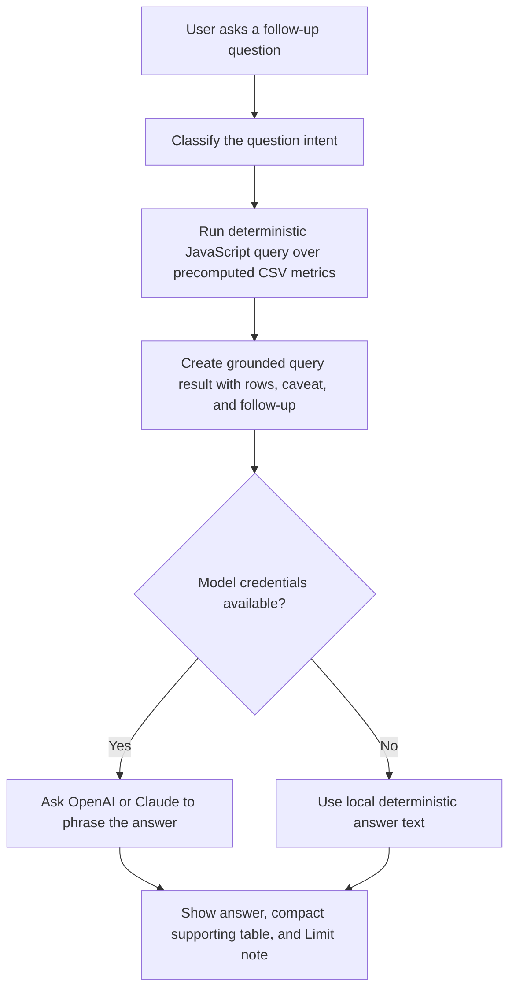

# Creator Opportunity Prototype

One-page Astro prototype for the Gates Higher Endeavor technical assessment. The app gives a busy Head of Creator Partnerships an at-a-glance recommendation from a TikTok trending CSV, plus a plain-English Q&A flow for follow-up questions.

## What The App Does

- Shows a one-screen strategy summary.
- Ranks creator partnership prospects using deterministic scoring.
- Keeps verified and celebrity-scale creators visible as reach benchmarks without letting that status automatically drive the outreach priority.
- Lets a user ask natural-language questions about creators, engagement, reach benchmarks, content themes, and data limitations.
- Uses local deterministic answers when no model credentials are configured.
- Uses OpenAI or Claude to phrase the final answer when model credentials are present.

## Definition Of Promising

For this prototype, "promising" means:

> A creator or content pattern with enough reach to matter, unusually strong audience response, and some evidence that performance is not purely a one-off celebrity/outlier effect.

Because the dataset has no follower count, the app uses:

- `views` as the reach proxy
- `likes + comments + shares` as total interactions
- `(likes + comments + shares) / views` as engagement efficiency
- `shares / views` and `comments / views` as stronger intent signals
- multiple videos from the same creator as a light consistency signal

## Creator Opportunity Score

The scoring uses percentile ranks so celebrity-scale outliers do not dominate.

```text
video_score =
  0.30 * views_percentile +
  0.25 * interactions_percentile +
  0.25 * engagement_rate_percentile +
  0.12 * share_rate_percentile +
  0.08 * comment_rate_percentile
```

```text
creator_score =
  0.55 * best_video_score +
  0.30 * average_video_score +
  consistency_bonus +
  0.05 * engagement_rate
```

`consistency_bonus` is capped at `0.10` before it is added to the creator score.

## Creator Context Labels

Each creator is classified internally so verified or celebrity-scale creators can be handled as reach benchmarks instead of automatic outreach priorities.

- `unverified - mid-tail prospect`
- `unverified - emerging signal`
- `verified - reach benchmark`
- `celebrity-scale benchmark`

The main screen shows creator topic tags such as `#kenma` or `#attackontitan` in the ranked list because those are useful to the Head of Creator Partnerships. Repeated unverified prospect labels are hidden from the main screen because all ranked outreach candidates share that broad classification. Verified and celebrity-scale creators are still shown as benchmarks rather than the default outreach list, so it is clear they were considered without allowing raw fame to answer the whole strategy question.

## Q&A Flow



The Q&A panel starts empty on purpose. It should not show a draft answer before the user asks a question because that makes the prototype feel like a static mock instead of a working data tool.

This is intentionally not an open-ended chatbot. The app first maps each question to a supported intent, then runs a deterministic CSV query. The LLM only phrases that grounded result. Questions outside the supported data fields return an unsupported or clarifying response instead of letting the model guess.

The API returns a suggested follow-up, but the current screen keeps the visible response focused on the answer, a compact supporting table, and a small `Limit` note. The model is instructed not to repeat the caveat in the answer body because the interface displays that limitation separately.

Supported intents:

- `best_partnership_prospects`
- `top_creators_by_engagement`
- `high_reach_benchmarks`
- `promising_content_themes`
- `creator_lookup`
- `data_limitations`
- `clarify`
- `unsupported`

## Trust And Limits

The model is used for language, not math. The calculations come from deterministic code, and the model only explains the result. That keeps the experience natural while reducing hallucination risk.

Unsupported questions are a first-class path. If the CSV cannot answer something, the app says what data is missing. The API also returns a safer suggested follow-up for future UI expansion.

The CSV does not include:

- follower counts
- audience demographics
- audience location
- creator availability
- current creator status
- brand-safety review

## Run Locally

```bash
pnpm install
pnpm dev
```

Open `http://127.0.0.1:4321/`.

To enable live model phrasing, copy `.env.example` to `.env` and set one provider's credentials.

```env
LLM_PROVIDER=auto
OPENAI_API_KEY=
OPENAI_MODEL=gpt-5-mini
ANTHROPIC_API_KEY=
ANTHROPIC_AUTH_TOKEN=
ANTHROPIC_MODEL=claude-haiku-4-5-20251001
```

`LLM_PROVIDER=auto` tries OpenAI first when `OPENAI_API_KEY` is present, then Claude when `ANTHROPIC_API_KEY` or `ANTHROPIC_AUTH_TOKEN` is present. Set `LLM_PROVIDER=openai` or `LLM_PROVIDER=anthropic` to force a provider.

Use `ANTHROPIC_API_KEY` for a Claude API key. Use `ANTHROPIC_AUTH_TOKEN` only when you intentionally want to reuse a Claude Code-style bearer token. Do not set both Anthropic credential types at the same time.

## What I Would Improve With More Time

- Improve supporting-row table formatting and coverage.
- Add a brand-safety/manual-review checklist.
- Add a CSV upload option.
- Add stricter structured output for model-based intent classification.
- Add tests for scoring and query intent coverage.
