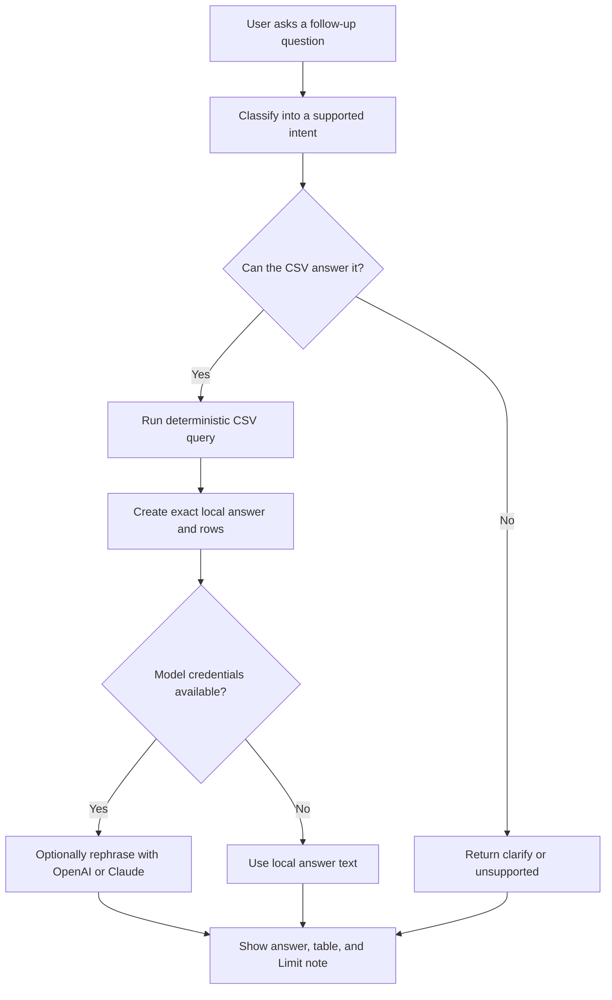

# Creator Opportunity Prototype

One-page Astro prototype for the Gates Higher Endeavor technical assessment. It helps a Head of Creator Partnerships quickly decide where to focus in a TikTok trending dataset, then ask grounded follow-up questions.

## What It Does

- Shows an at-a-glance creator partnership recommendation.
- Ranks outreach prospects with deterministic scoring from the CSV.
- Keeps verified and celebrity-scale creators visible as reach benchmarks, without letting status automatically drive priority.
- Supports plain-English follow-up questions for creators, engagement, reach benchmarks, content themes, objective spreadsheet lookups, and data limitations.
- Works without an AI model by returning local deterministic answers; OpenAI or Claude can optionally rephrase those grounded answers.

## Scoring Approach

For this prototype, "promising" means a creator or content pattern with enough reach to matter, unusually strong audience response, and some evidence that performance is not only a one-off celebrity/outlier effect.

Because the CSV has no follower count, the app uses `views` as reach, `likes + comments + shares` as interactions, engagement rate as efficiency, share/comment rates as stronger intent signals, and repeat videos as a light consistency signal.

```text
video_score =
  0.30 * views_percentile +
  0.25 * interactions_percentile +
  0.25 * engagement_rate_percentile +
  0.12 * share_rate_percentile +
  0.08 * comment_rate_percentile

creator_score =
  0.55 * best_video_score +
  0.30 * average_video_score +
  consistency_bonus +
  0.05 * engagement_rate
```

`consistency_bonus` is capped at `0.10`. Creator context labels are computed internally so the app can separate likely outreach prospects from reach benchmarks:

- `unverified - mid-tail prospect`
- `unverified - emerging signal`
- `verified - reach benchmark`
- `celebrity-scale benchmark`

The main screen hides repeated prospect labels from the ranked list and instead shows useful topic tags such as `#kenma` or `#attackontitan`.

## Q&A Flow



This is intentionally not an open-ended chatbot. The app maps each question to a supported intent, runs deterministic JavaScript against precomputed CSV metrics, and only then displays the answer. If model credentials are present, the model improves wording only; it does not invent calculations. If no model is configured, supported questions still work with the exact local answer text.

Supported intents:

- `best_partnership_prospects`
- `top_creators_by_engagement`
- `high_reach_benchmarks`
- `promising_content_themes`
- `creator_video_count`, for objective questions like "Which creators have 3 or more videos?"
- `creator_lookup`
- `data_limitations`
- `clarify`
- `unsupported`

Unsupported questions are a first-class path. If the CSV cannot answer something, such as follower counts, audience demographics, creator availability, location, current status, or brand-safety review, the app says what data is missing instead of letting the model guess.

## Run Locally

```bash
pnpm install
pnpm dev
```

Open `http://127.0.0.1:4321/`.

Model phrasing is optional. To enable it, copy `.env.example` to `.env` and set one provider's credentials:

```env
LLM_PROVIDER=auto
OPENAI_API_KEY=
OPENAI_MODEL=gpt-5-mini
ANTHROPIC_API_KEY=
ANTHROPIC_AUTH_TOKEN=
ANTHROPIC_MODEL=claude-haiku-4-5-20251001
```

`LLM_PROVIDER=auto` tries OpenAI first when `OPENAI_API_KEY` is present, then Claude when `ANTHROPIC_API_KEY` or `ANTHROPIC_AUTH_TOKEN` is present. Set `LLM_PROVIDER=openai` or `LLM_PROVIDER=anthropic` to force a provider. Use `ANTHROPIC_AUTH_TOKEN` only when intentionally reusing a Claude Code-style bearer token, and do not set both Anthropic credential types at the same time.

## With More Time

- Add tests for scoring and query intent coverage.
- Add a CSV upload option.
- Add a brand-safety/manual-review checklist.
- Add stricter structured output for model-assisted phrasing.
